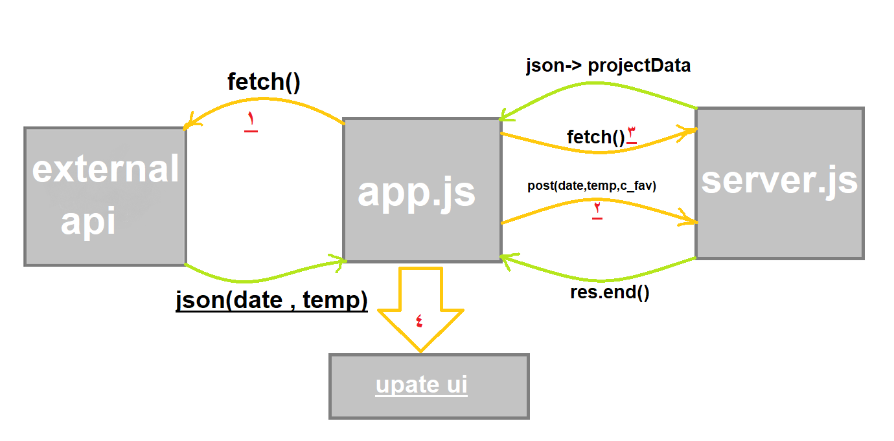

# Weather-Journal App Project

## Overview
This project requires you to create an asynchronous web app that uses Web API and user data to dynamically update the UI. 

## Instructions
This will require modifying the `server.js` file and the `website/app.js` file. You can see `index.html` for element references, and once you are finished with the project steps, you can use `style.css` to style your application to customized perfection.

## Extras
If you are interested in testing your code as you go, you can use `tests.js` as a template for writing and running some basic tests for your code.

### what we are going to do is ....

## what is done 

### - Project Environment Setup
- install (express - cors - body-parser).
- setLocal server.
- Create API credentials on OpenWeatherMap.com.
- change id in HTML.
- The div with the id, entryHolder should have three child divs with the ids:
    - date
    - temp
    - content
- Adds an event listener to an existing HTML button from DOM using Vanilla JS.

### - APIs and Routes
- adding opjectData 
- using fetch to get data successfully from external API.
- creating git route Endpoint
- creating post route Endpoint 
- saving temp , felling and date in the local api py calling post route
- return opjectData from local server api

### - UPDATE UI Dynamic 
- add data to udate , utemp , ucontent after final data has been returned
- adding atripute units to the external api link to converrt temp to celecias unit.

